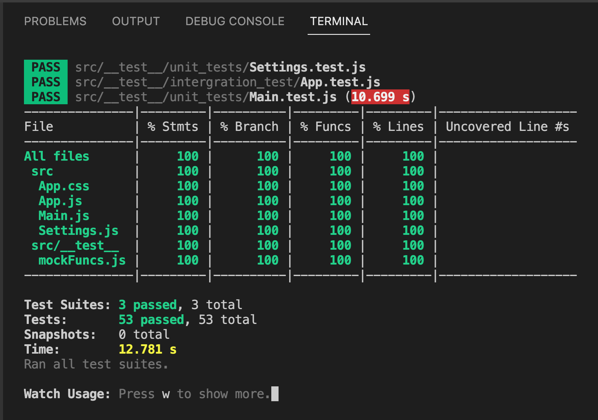

## Web App - Typing Test

[Typing Test.webm](https://user-images.githubusercontent.com/66141752/192047435-35980348-069e-48b7-b745-cbb7f16966d3.webm)

### [DEMO](https://drive.google.com/file/d/1PNma30nUL6MmBqpDdpx2gqUzDv-lTRJ0/view?usp=sharing) | [APP](https://typing-test-pz.netlify.app)

### To get started

Under settings you can choose your test time frame and language - by default it is 15 seconds and English.

_New Quote button_: fetches new quotes

_Redo button_: resets to previous quotes and fetches new ones once completed previous ones

_Button shortcuts_: New Quote (control + n) and Redo (control + r)

### Tech-Stack

- JavaScript
- React
- Google API
- Jest

### Test

### Calculations

wpm (words per minute): total number of characters (including spaces) of words you got right divided by five then divided by the time starting from first character typed

acc (accuracy percentage): total number of characters (including spaces) of words you got right divided by all character in the list of words
